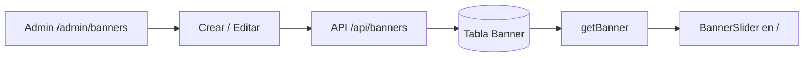

# Panel admin — Banners

Guía detallada para administrar banners en **curso-edemy**.

Volver al índice: [panel_admin.md](./panel_admin.md)

---

## Resumen

| Concepto | Detalle |
|----------|---------|
| **Admin** | `/admin/banners` |
| **Público** | Carrusel en la home (`/`) |
| **Quién puede gestionar** | Solo rol `ADMIN` |

---

## Modelo de datos

Tabla `Banner` (`prisma/schema.prisma`):

| Campo | Descripción |
|-------|-------------|
| `url` | Enlace al hacer clic (opcional) |
| `image` | URL de imagen o video |
| `status` | `1` activo · `0` inactivo · `2` eliminado |
| `order` | Posición en el carrusel (menor = primero) |
| `date_start` | Inicio de vigencia (opcional) |
| `date_end` | Fin de vigencia (opcional) |

Si las fechas están vacías, no se validan.

---

## API

| Acción | Método | Ruta |
|--------|--------|------|
| Crear | `POST` | `/api/banners` |
| Editar | `PUT` | `/api/banners/[id]` |
| Eliminar | `DELETE` | `/api/banners/[id]` |
| Reordenar | `PATCH` | `/api/banners/reorder` |

---

## Flujo completo

