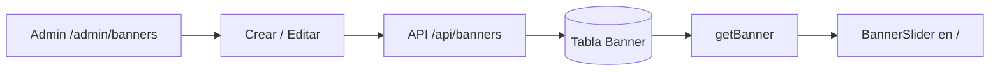

# Panel admin — Banners

Guía detallada para administrar banners en **curso-edemy**.

Volver al índice: [panel_admin.md](./panel_admin.md)

---

## Resumen

| Concepto | Detalle |
|----------|---------|
| **Admin** | `/admin/banners` |
| **Público** | Carrusel en la home (`/`) |
| **Quién puede gestionar** | Solo rol `ADMIN` |

---

## Modelo de datos

Tabla `Banner` (`prisma/schema.prisma`):

| Campo | Descripción |
|-------|-------------|
| `url` | Enlace al hacer clic (opcional) |
| `image` | URL de imagen o video |
| `status` | `1` activo · `0` inactivo · `2` eliminado |
| `order` | Posición en el carrusel (menor = primero) |
| `date_start` | Inicio de vigencia (opcional) |
| `date_end` | Fin de vigencia (opcional) |

Si las fechas están vacías, no se validan.

---

## Crear un banner

1. Ir a `/admin/banners`
2. Clic en **Nuevo Banner**
3. Completar el formulario y guardar

### Campos del formulario

| Campo | Obligatorio | Notas |
|-------|-------------|-------|
| URL de imagen o video | Sí* | URL externa o archivo subido |
| Enlace al hacer clic | No | Abre en nueva pestaña |
| Orden | No | Por defecto `0` |
| Fecha inicio / fin | No | Controlan visibilidad en la home |
| Activo / Inactivo | Sí | Solo activos se muestran en la home |

\* Debe existir imagen o video (subida o URL).

### Requisitos de imagen

- Proporción **832 × 456 px** (o equivalente)
- Formatos: JPG, PNG, WEBP
- El recortador del admin fuerza la proporción al subir
- El servidor valida la relación de aspecto

### Video

- Subida: **MP4**
- También se admite URL directa a `.mp4` u otro formato soportado en el front

### Almacenamiento

- Archivos subidos → **DigitalOcean Spaces** (`upload_course/banners/`)
- URLs externas → se guardan tal cual en `image`

---

## Editar y eliminar

- **Editar:** botón *Editar* → mismo modal con datos cargados
- **Eliminar:** confirmación → `status: 2` (soft delete, no borra el registro)

### API

| Acción | Método | Ruta |
|--------|--------|------|
| Crear | `POST` | `/api/banners` |
| Editar | `PUT` | `/api/banners/[id]` |
| Eliminar | `DELETE` | `/api/banners/[id]` |
| Reordenar | `PATCH` | `/api/banners/reorder` |

---

## Listado en admin

Columnas de la tabla en `/admin/banners`:

| Columna | Contenido |
|---------|-----------|
| **Orden** | Número + icono ☰ para reordenar |
| **Vista previa** | Miniatura, *ver enlace* (si hay URL), icono de estado |
| **Vigencia** | Fechas inicio y fin |
| **Acciones** | Editar / Eliminar |

Iconos de estado bajo la miniatura:

- ✓ verde → activo
- ⚠ amarillo → inactivo

---

## Ordenar banners

El carrusel de la home respeta el campo `order` (0, 1, 2…).

**Desktop:** arrastra el icono **☰** y suelta sobre otra fila.

**Móvil:** mantén presionado **☰** y arrastra hacia arriba o abajo.

Al soltar se guarda automáticamente vía `PATCH /api/banners/reorder`.

---

## Dónde se muestran (Home)

**Ruta:** `/`

### Condiciones para aparecer

Un banner se muestra solo si:

1. `status === 1` (activo)
2. Fecha actual ≥ `date_start` (si existe)
3. Fecha actual ≤ `date_end` (si existe)
4. Tiene `image` válida

Consulta: `getBanner()` → `src/actions/principal/getBanner.js`  
Filtro: `getActiveBannerWhere()` → `src/utils/bannerUtils.js`

### Carrusel

| Dispositivo | Comportamiento |
|-------------|----------------|
| **Móvil** (`< 700px`) | Un banner, transición suave, swipe, puntos y flechas |
| **Desktop** | Splide centrado: activo grande, laterales más pequeños |

- Clic con `url` → nueva pestaña
- Soporta imagen y video (autoplay silenciado en loop)

> `PageBanner` es otro componente (breadcrumb en páginas internas). No usa la tabla `Banner`.

---

## Flujo completo



---

## Archivos clave

```
prisma/schema.prisma
src/app/admin/banners/          → UI admin
src/app/api/banners/            → API CRUD + reorder
src/utils/bannerUtils.js
src/services/bannerUpload.js
src/app/page.js                 → Home
src/components/Index/BannerSlider.jsx
```

---

## Documentación relacionada

- [Panel admin — índice](./panel_admin.md)
- [Instalación](./install.md)
