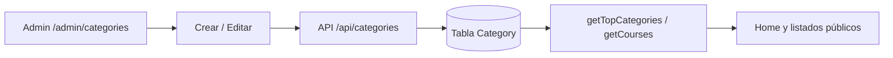

# Panel admin — Categorías

Guía detallada para administrar categorías de cursos en **curso-edemy**.

Volver al índice: [panel_admin.md](./panel_admin.md)

---

## Resumen

| Concepto | Detalle |
|----------|---------|
| **Admin** | `/admin/categories` |
| **Público** | Home, listados y filtros de cursos |
| **Quién puede gestionar** | Solo rol `ADMIN` |

---

## Modelo de datos

Tabla `Category` (`prisma/schema.prisma`):

| Campo | Descripción |
|-------|-------------|
| `name` | Nombre de la categoría (único) |
| `status` | `1` activo · `0` inactivo · `2` eliminado |
| `logo` | URL de imagen (opcional) |
| `created_at` | Fecha de creación |
| `updated_at` | Última actualización |

Relación: `courses` — cursos asignados vía `Course.categoryId`.

---

## API

| Acción | Método | Ruta |
|--------|--------|------|
| Crear | `POST` | `/api/categories` |
| Editar / soft delete | `PUT` | `/api/categories/[categoryId]` |
| Eliminar físico | `DELETE` | `/api/categories/[categoryId]` |

---

## Flujo completo

