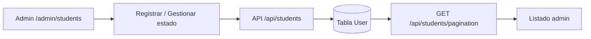

# Panel admin — Estudiantes

Guía detallada para administrar estudiantes en **curso-edemy**.

> Cubre el listado y registro en `/admin/students`. No incluye *Asignar módulo* (`/admin/students/assign-module`).

Volver al índice: [panel_admin.md](./panel_admin.md)

---

## Resumen

| Concepto | Detalle |
|----------|---------|
| **Admin** | `/admin/students` |
| **Público** | Área de usuario, matrículas y cursos inscritos |
| **Quién puede gestionar** | Solo rol `ADMIN` |

---

## Modelo de datos

Tabla `User` (`prisma/schema.prisma`) con `role: USER`:

| Campo | Descripción |
|-------|-------------|
| `name` | Nombre completo |
| `email` | Correo único (login) |
| `hashedPassword` | Contraseña hasheada con bcrypt |
| `role` | Siempre `USER` |
| `status` | `1` activo · `0` inactivo · `2` eliminado |
| `created_at` | Fecha de registro |

Relaciones en el listado: `profile`, `enrolments`.

---

## API

| Acción | Método | Ruta |
|--------|--------|------|
| Listar (paginado) | `GET` | `/api/students/pagination` |
| Registrar | `POST` | `/api/students` |
| Editar | `PUT` | `/api/students/[studentId]` |
| Cambiar estado | `POST` | `/api/students/change-status` |
| Asignar módulo | `POST` | `/api/students/assign-module` |

---

## Flujo completo

