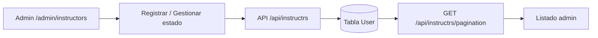

# Panel admin — Instructores

Guía detallada para administrar instructores en **curso-edemy**.

Volver al índice: [panel_admin.md](./panel_admin.md)

---

## Resumen

| Concepto | Detalle |
|----------|---------|
| **Admin** | `/admin/instructors` |
| **Público** | Panel del instructor (`/instructor`) y perfiles en el sitio |
| **Quién puede gestionar** | Solo rol `ADMIN` |

---

## Modelo de datos

Tabla `User` (`prisma/schema.prisma`) con `role: INSTRUCTOR`:

| Campo | Descripción |
|-------|-------------|
| `name` | Nombre completo |
| `email` | Correo único (login) |
| `hashedPassword` | Contraseña hasheada con bcrypt |
| `designation` | Cargo o designación (opcional) |
| `role` | Siempre `INSTRUCTOR` |
| `status` | `1` activo · `0` inactivo · `2` eliminado |
| `is_instructor` | Booleano (por defecto `false` en el esquema) |
| `created_at` | Fecha de registro |

Relaciones en el listado: `profile`, `courses`.

---

## API

| Acción | Método | Ruta |
|--------|--------|------|
| Listar (paginado) | `GET` | `/api/instructrs/pagination` |
| Registrar | `POST` | `/api/instructrs` |
| Cambiar estado | `POST` | `/api/instructrs/change-status` |

---

## Flujo completo

