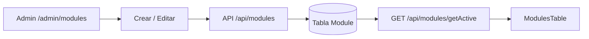

# Panel admin — Módulos

Guía detallada para administrar módulos en **curso-edemy**.

> Cubre el CRUD en `/admin/modules`. No incluye *Asignar curso* (`/admin/modules/asign-course`).

Volver al índice: [panel_admin.md](./panel_admin.md)

---

## Resumen

| Concepto | Detalle |
|----------|---------|
| **Admin** | `/admin/modules` |
| **Público** | Asignación curso-módulo y matrículas |
| **Quién puede gestionar** | Edición/eliminación: rol `ADMIN` |

---

## Modelo de datos

Tabla `Module` (`prisma/schema.prisma`):

| Campo | Descripción |
|-------|-------------|
| `title` | Título del módulo (único en edición) |
| `description` | Descripción (texto largo, opcional) |
| `logo` | URL de logo (opcional) |
| `status` | `1` activo · `0` inactivo · `2` eliminado |

Relaciones: `courseModules`, `enrolments`.

---

## API

| Acción | Método | Ruta |
|--------|--------|------|
| Crear | `POST` | `/api/modules` |
| Editar / soft delete | `PUT` | `/api/modules/[moduleId]` |
| Listar activos/inactivos | `GET` | `/api/modules/getActive` |
| Eliminar físico | `DELETE` | `/api/modules/[moduleId]` |

---

## Flujo completo

