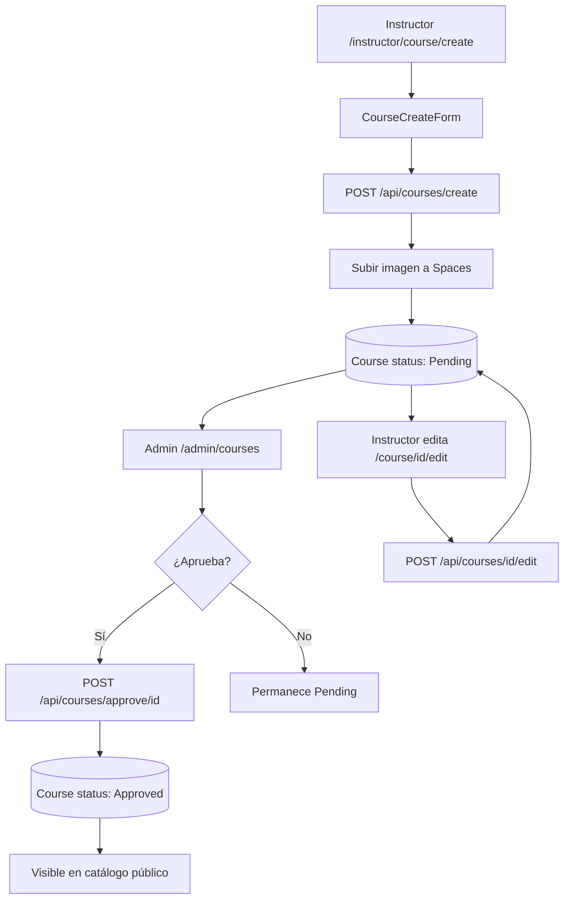

# Panel instructor — Crear y editar curso

Guía para que el instructor registre un curso, lo edite y comprenda el flujo de aprobación por el administrador.

Volver al índice: [panel_instructor.md](./panel_instructor.md)

---

## Resumen

| Concepto | Detalle |
|----------|---------|
| **Crear curso** | `/instructor/course/create` |
| **Editar curso** | `/instructor/course/[courseId]/edit` |
| **Listado de cursos** | `/instructor/courses` |
| **Quién puede gestionar** | Instructor dueño del curso (o `ADMIN`) |
| **Estado inicial al crear** | `Pending` (pendiente de aprobación) |
| **Visibilidad pública** | Solo cursos con `status: Approved` |

Al crear un curso, el sistema responde: *"Curso enviado. Será aprobado próximamente."* El curso **no aparece** en la home ni en listados públicos hasta que un admin lo apruebe.

---

## Modelo de datos

Tabla `Course` (`prisma/schema.prisma`):

| Campo | Descripción |
|-------|-------------|
| `userId` | ID del instructor propietario |
| `categoryId` | Categoría del curso |
| `title` | Título |
| `slug` | URL amigable (generado automáticamente) |
| `description` | Descripción (HTML, editor enriquecido) |
| `regular_price` | Precio actual |
| `before_price` | Precio anterior (opcional) |
| `lessons` | Contador de lecciones (string, se actualiza al agregar assets) |
| `image` | URL de portada en DigitalOcean Spaces |
| `access_time` | Tiempo de acceso (por defecto `"Lifetime"`) |
| `requirements` | Requisitos (HTML) |
| `what_you_will_learn` | Lo que aprenderás (HTML) |
| `who_is_this_course_for` | Para quién es el curso (HTML) |
| `status` | `Pending` · `Approved` · `Deleted` |
| `hide` | Ocultar curso (booleano) |

Enum `Status`:

| Valor | Significado |
|-------|-------------|
| `Pending` | En revisión; no visible al público |
| `Approved` | Aprobado; visible en catálogo y home |
| `Deleted` | Eliminado (soft delete) |

---

## Crear curso

### Ruta y componentes

| Elemento | Ubicación |
|----------|-----------|
| Página | `src/app/instructor/course/create/page.jsx` |
| Formulario | `src/components/Instructor/CourseCreateForm.jsx` |
| API | `POST /api/courses/create` |

### Campos del formulario

| Campo | Requerido | Notas |
|-------|-----------|-------|
| Categoría | Sí | `CategorySelect` — categorías activas |
| Título | Sí | Genera el `slug` automáticamente |
| Descripción | Sí | Editor enriquecido (`RichTextEditor`) |
| Requisitos | Sí | Editor enriquecido |
| Lo que aprenderás | Sí | Editor enriquecido |
| Para quién es este curso | Sí | Editor enriquecido |
| Imagen de portada | Sí | Recorte 750×500 px (`ImageUploader` tipo `course`) |
| Tiempo de acceso | No | Por defecto `"Lifetime"` |

Los campos requeridos muestran asterisco naranja (`RequiredMark`). Si hay más de 2 errores de validación, el cliente muestra un solo toast: *"Por favor complete su formulario"*.

### Proceso de envío

1. El instructor completa el formulario y pulsa **Crear curso** (botón verde, alineado a la derecha).
2. El cliente arma un `FormData` con todos los campos + archivo de imagen recortado.
3. La API valida sesión, campos obligatorios e imagen.
4. La imagen se sube a `upload_course/courses/` vía `imageUploadService`.
5. Se crea el registro en `Course` con `status: Pending` (valor por defecto del esquema).
6. Toast de éxito y redirección al listado de cursos.

---

## Editar curso

### Ruta y componentes

| Elemento | Ubicación |
|----------|-----------|
| Página | `src/app/instructor/course/[courseId]/edit/page.jsx` |
| Formulario | `src/components/Instructor/EditCourseForm.jsx` |
| API | `POST /api/courses/[courseId]/edit` |

### Diferencias respecto a crear

| Aspecto | Crear | Editar |
|---------|-------|--------|
| Imagen | Obligatoria | Opcional (mantiene la actual si no se cambia) |
| Precios | Comentados en UI | Visibles (`regular_price`, `before_price`) |
| Slug | Siempre nuevo | Solo se regenera si cambia el título |
| Mensaje éxito | "Será aprobado próximamente" | "Curso actualizado exitosamente" |
| Permisos | Instructor autenticado | Solo dueño del curso o `ADMIN` |

**Importante:** editar un curso **no cambia** automáticamente su estado. Si ya estaba `Approved`, sigue aprobado. Si estaba `Pending`, sigue pendiente hasta que el admin apruebe.

---

## Flujo de aprobación (admin)

El instructor crea el curso → queda en `Pending` → el administrador lo revisa y aprueba.

### Panel admin

| Elemento | Ubicación |
|----------|-----------|
| Listado de cursos | `/admin/courses` |
| Nuevos cursos | `/admin/courses/new-arrival` |
| Botón aprobar | `ApproveNowBtn.jsx` |

### API de aprobación

| Acción | Método | Ruta |
|--------|--------|------|
| Aprobar curso | `POST` | `/api/courses/approve/[approveId]` |
| Cambiar estado | `POST` | `/api/courses/change-status` |

Al aprobar, el campo `status` pasa a `Approved`. Solo entonces el curso puede aparecer en:

- Home (`in_home_page`)
- Listados por categoría
- Búsquedas públicas
- Asignación a módulos (admin)

---

## API — resumen

| Acción | Método | Ruta | Body |
|--------|--------|------|------|
| Crear curso | `POST` | `/api/courses/create` | `multipart/form-data` |
| Editar curso | `POST` | `/api/courses/[courseId]/edit` | `multipart/form-data` |
| Listar cursos del instructor | `GET` | `/api/instructrs/courses/pagination` | Query: `page`, `categoryId` |
| Cambiar estado (instructor) | `POST` | `/api/instructrs/courses/change-status` | JSON: `courseId`, `status` |
| Aprobar (admin) | `POST` | `/api/courses/approve/[approveId]` | — |

---

## Flujo completo



---

## Archivos clave

```
src/
├── app/instructor/course/
│   ├── create/page.jsx
│   └── [courseId]/edit/page.jsx
├── components/Instructor/
│   ├── CourseCreateForm.jsx
│   └── EditCourseForm.jsx
└── app/api/courses/
    ├── create/route.js
    ├── [courseId]/edit/route.js
    └── approve/[approveId]/route.js
```
