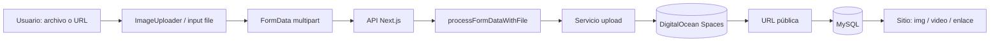

# Subida de archivos

Guía general del sistema de carga de archivos en **curso-edemy**.

Volver al índice: [panel_admin.md](./panel_admin.md) · [Instalación](./install.md)

---

## Resumen

| Concepto | Detalle |
|----------|---------|
| **Almacenamiento** | DigitalOcean Spaces (API compatible S3) |
| **Formato de envío** | `multipart/form-data` (`FormData`) desde el cliente |
| **Resultado** | URL pública guardada en MySQL |
| **Configuración** | Variables `DO_SPACES_*` en `.env` (ver `env.example`) |

No hay almacenamiento persistente en disco del servidor Next.js: todo archivo subido termina en Spaces y solo la **URL** queda en la base de datos.

---

## Modelo de datos

### Variables de entorno

| Variable | Uso |
|----------|-----|
| `DO_SPACES_ENDPOINT` | Endpoint del space (ej. `https://nyc3.digitaloceanspaces.com`) |
| `DO_SPACES_REGION` | Región (ej. `NYC3`) |
| `DO_SPACES_ACCESS_KEY` | Clave de acceso |
| `DO_SPACES_SECRET_KEY` | Clave secreta |
| `DO_SPACES_BUCKET` | Nombre del bucket |
| `STORAGE_PROVIDER` | Opcional; por defecto `digitalocean` |

Si faltan variables, los servicios de subida responden con error de configuración.

### Servicios de subida

| Servicio | Archivo | Acepta | Carpeta base |
|----------|---------|--------|--------------|
| `imageUploadService` | `src/services/imageUpload.js` | Solo `image/*` | `images/` o ruta custom |
| `bannerUploadService` | `src/services/bannerUpload.js` | JPG, PNG, WEBP, MP4, WebM | `upload_course/banners/` |
| `fileUploadService` | `src/services/fileUpload.js` | Imagen, audio, video, documentos | `upload_course/{images\|audios\|videos\|documents}/` |

Todos usan `DigitalOceanStorageService` (`src/services/storage/digitalocean.js`).

### Objeto archivo en la API

`processFormDataWithFile()` (`src/utils/fileProcessing.js`) convierte el blob del formulario en:

| Campo | Descripción |
|-------|-------------|
| `buffer` | Contenido del archivo |
| `originalname` | Nombre original |
| `mimetype` | Tipo MIME |
| `size` | Tamaño en bytes |

Campo del formulario por defecto: `imageFile`. En lecciones/adjuntos suele ser `file`.

### Rutas en Spaces (por módulo)

| Módulo | Ruta en bucket |
|--------|----------------|
| Banners | `upload_course/banners/` |
| Categorías | `upload_course/categories/` |
| Foto de perfil | `upload_course/profile/` |
| Portada de curso | `upload_course/courses/` |
| Lecciones (video/audio/doc) | `upload_course/videos`, `audios`, `documents` |
| Adjuntos de lección | `upload_course/course/{courseId}/asset/{lessonId}/` |

### Componente UI principal

`ImageUploader` (`src/app/admin/banners/_components/ImageUploader.jsx`):

| Tipo | Proporción | Notas |
|------|------------|-------|
| `banner` | 832×456 | Imagen o video MP4 (máx. 15 MB) |
| `category` | 650×433 | Solo imagen + recorte |
| `profile` | 200×200 | Solo imagen + recorte |
| `course` | 750×500 | Solo imagen + recorte |

Imágenes: selección → recorte (`ImageCropper`) → blob en `FormData`. También se admite **URL externa** sin subir.

---

## API

Rutas que procesan archivos (todas vía multipart salvo URL externa en el body):

| Módulo | Método | Ruta | Servicio |
|--------|--------|------|----------|
| Banners | `POST` / `PUT` | `/api/banners`, `/api/banners/[id]` | `bannerUploadService` |
| Categorías | `POST` / `PUT` | `/api/categories`, `/api/categories/[id]` | `imageUploadService` |
| Foto perfil | `POST` | `/api/user/[userId]/profile-photo` | `imageUploadService` |
| Crear curso | `POST` | `/api/courses/create` | `imageUploadService` |
| Editar curso | `PUT` | `/api/courses/[courseId]/edit` | `imageUploadService` |
| Crear lección | `POST` | `/api/courses/[courseId]/lessons` | `fileUploadService` |
| Editar lección | `PUT` | `/api/courses/[courseId]/lessons/[lessonId]` | `fileUploadService` |
| Adjuntos lección | `POST` | `/api/courses/.../lessons/[lessonId]/files-asset` | `fileUploadService` |
| Borrar adjunto | `DELETE` | `/api/courses/.../files-asset/[filesAssetId]` | `fileUploadService.deleteFile` |

Al **reemplazar** un archivo, la API sube el nuevo, actualiza la URL en BD e intenta borrar el anterior en Spaces.

---

## Flujo completo



### Flujo resumido

1. **Cliente** — el usuario elige archivo (o pega URL externa).
2. **FormData** — se envía con `axios` y `Content-Type: multipart/form-data`. Progreso opcional con `useFileUpload`.
3. **API** — valida sesión/rol, parsea campos + archivo con `processFormDataWithFile`.
4. **Subida** — el servicio correspondiente envía el buffer a Spaces (`ACL: public-read`).
5. **Persistencia** — se guarda la URL en el modelo Prisma (`Banner.image`, `Category.logo`, `User.image`, `Course.image`, `Asset.config`, `FilesAsset.url`, etc.).
6. **Consumo** — el front muestra la URL directamente (carrusel, portadas, reproductor, descargas).

### Qué no usa subida de archivos

- Registro admin de estudiantes/instructores (solo JSON).
- Perfil básico `/profile/basic-information` (solo texto).
- Lecciones con URL externa (YouTube, enlace) sin archivo adjunto.

---

## Archivos clave

```
src/services/storage/
  digitalocean.js          → cliente S3 / Spaces
  index.js                 → factory getStorageService()
src/services/
  imageUpload.js           → imágenes
  bannerUpload.js          → banners
  fileUpload.js            → lecciones y adjuntos
src/utils/fileProcessing.js
src/hooks/useFileUpload.js
src/app/admin/banners/_components/
  ImageUploader.jsx        → recorte y preview
  ImageCropper.jsx
```

---

## Documentación relacionada

- [Instalación](./install.md) — variables `DO_SPACES_*`
- [Banners](./panel_admin_banners.md) — subida en carrusel home
- [Categorías](./panel_admin_categorias.md) — logo de categoría
